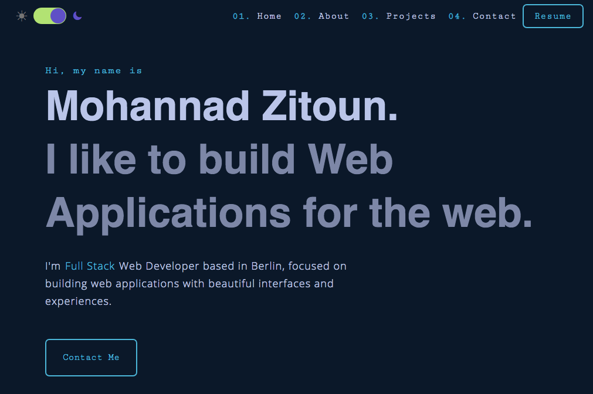

# My portfolio

> This is a [blog and photo gallery app](https://www.mohannadzitoun.com/ 'my portfolio') build with the MERN stack & Redux.



## Features

- Home, about, projects and contact page.
- Responsive design.
- Animation.

## Install Dependencies (root)

```bash
npm install
```

## Run

```
 # Run  (:3000)
 npm start
```
